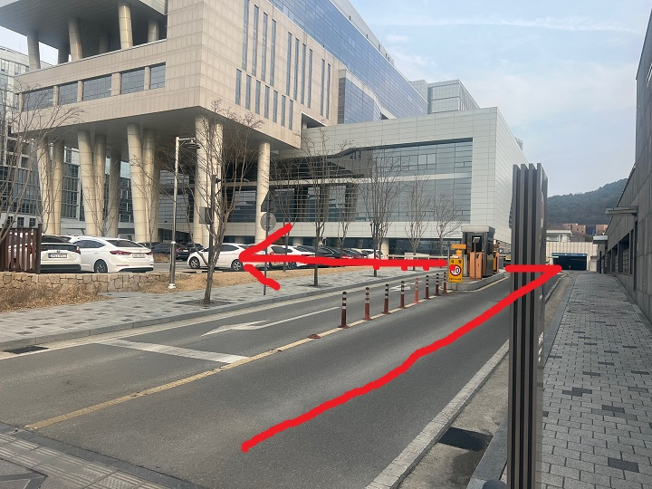
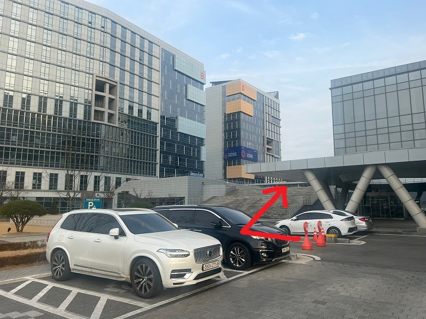
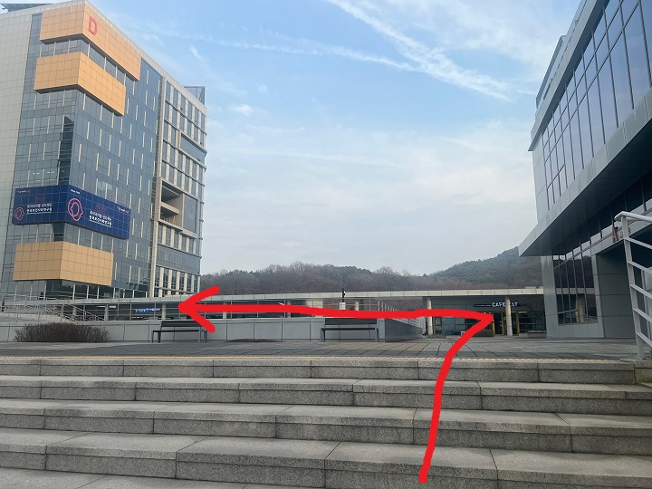
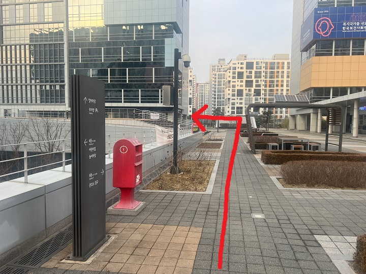
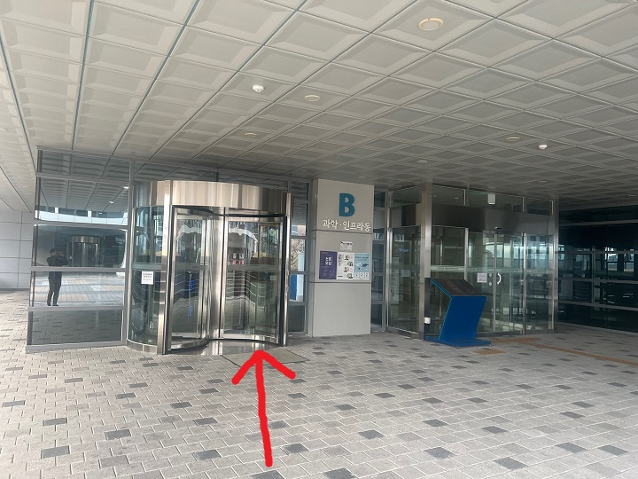

## 세종국책연구단지 오시는 길~
- 내비에서 "(나라키움) 세종국책연구단지"를 찾음(안되면 시청대로 370) 
세종특별자치시 시청대로 370 나라키움 세종국책연구단지
- 주차는 주차 게이트 들어와서 좌회전 진입 후 주차, 
주말이어서 공간 많습니다. 

- 바로 앞에 있는 건물 옆으로 계단이 있습니다. 

- 계단을 올라와서 정면에 카페 앞에서 좌회전하시고, 

- 정면으로 아파트가 보이는데, 좌측 건물이 B동입니다. 

- 건물명을 확인하시고 출입증을 교환하시고 들어오셔서 10층으로 올라오세요. 

정면에 등을 보이는 엘리베이터가 있으니 이를 타고 2층으로 올라가자. 

- 2층에 내리면 보이는 회의실이 오늘 간담회 진행장소이다^^
